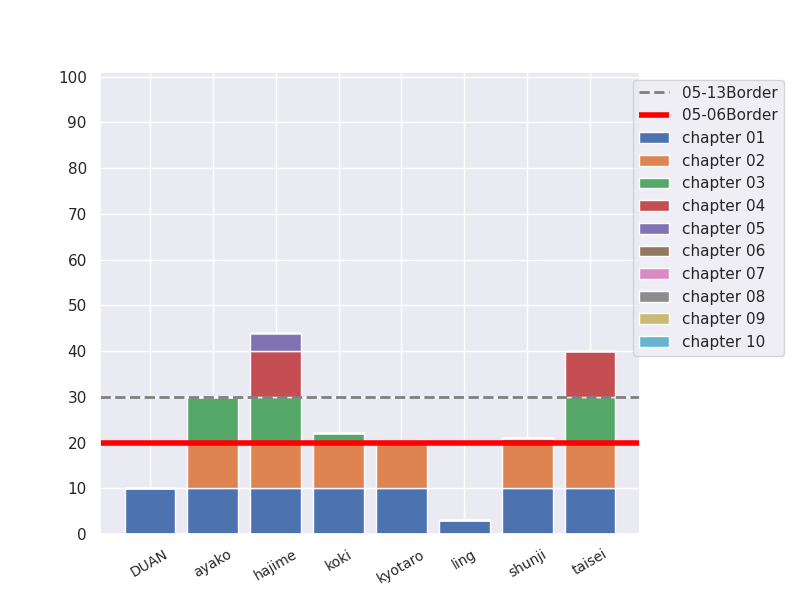

# 100knock2023

小町研2023年度新入生向け勉強会として、言語処理100本ノックに取り組みます。  
教材URL: https://nlp100.github.io/ja/

毎週1章分（10問）解いてください。   
勉強会の時間には、事前に割り当てられた問題の解説をしてもらいます。

## usage

初回はこのレポジトリを clone してください。

```
$ git clone https://github.com/tmu-nlp/100knock2023.git
```

コードを書いたら remote repository に push してください。
チャプター名、ファイル名はすべて二桁の数字にしてください（例: `chapter01`, `knock00.py`）。
```
$ git branch <任意のブランチ名(以下、b_name)> (e.g. git branch hajime)
$ git checkout <b_name>
$ git add <任意のファイル・フォルダ> (e.g. git add ./hajime/chapter01/knock01.py)
$ git commit -m 'your message'
$ git pull origin main
$ git push origin <b_name>
```
## 注意事項
test
新入生はできるだけ Python3 系で書いてください。
わからないところは**積極的**に TA か研究室の人に聞いてください。
**他の人のディレクトリを変更することは絶対にやめてください。**
（他の人のコードを閲覧したい場合は、Web サイト上から閲覧してください。）
chapter##/knockXX.py のフォルダ名とファイル名を間違えると進捗グラフに反映されません。

## みんなの進捗




# 100knock2023 (English) 

We will work NLP 100 knockings as the study meeting for the newcomers in 2023. 
Let's solve the 10 questions every week.
TA and participants review your code.  

You should clone this repository the first time.
```
$ git clone https://github.com/tmu-nlp/100knock2023.git
```

"##" and "XX" mean "two-digit question number". (e.g. `chapter01`, `knock00.py`)
```
$ git branch <any branch name(b_name)> (e.g. git branch hajime)
$ git checkout <b_name>
$ git add <any file or folder> (e.g. git add ./hajime/chapter01/knock01.py)
$ git commit -m 'your message'
$ git pull origin main
$ git push origin <b_name>
```

## Notes

Please use Python3.  
Please ask TA's helps **positively**.  
Please commit your script and picture only. (Don't commit the other files such as text file because file size of the output will be gradually larger.)  
**Don't change the others' directories.**  
Teaching materials of this meeting are written in Japanese, so some participants need to translate them.
